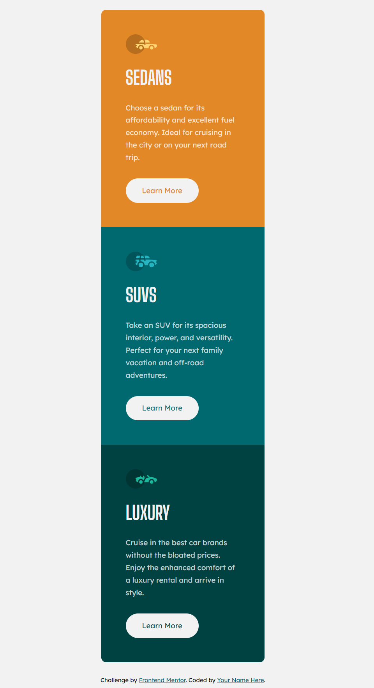
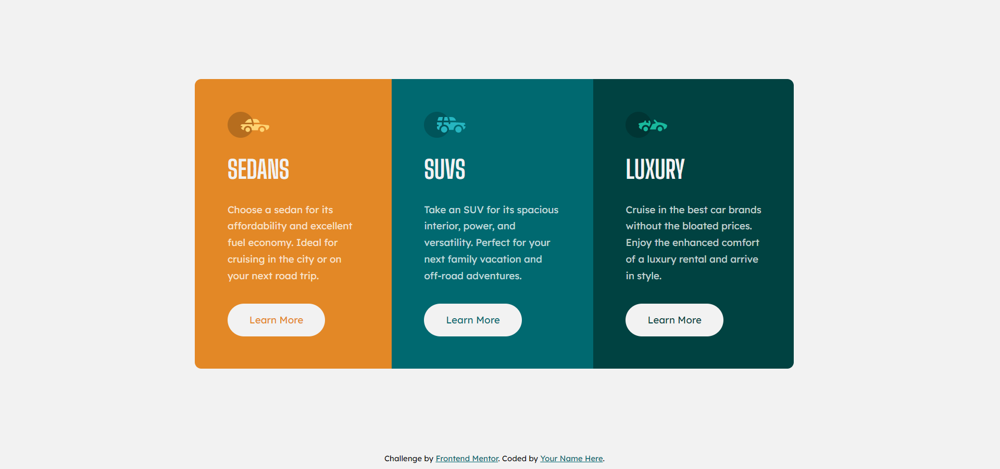

# Frontend Mentor - 3-column preview card component solution

This is a solution to the [3-column preview card component challenge on Frontend Mentor](https://www.frontendmentor.io/challenges/3column-preview-card-component-pH92eAR2-). Frontend Mentor challenges help you improve your coding skills by building realistic projects. 

## Table of contents

- [Overview](#overview)
  - [The challenge](#the-challenge)
  - [Screenshot](#screenshot)
  - [Links](#links)
- [My process](#my-process)
  - [Built with](#built-with)
  - [What I learned](#what-i-learned)
  - [Useful resources](#useful-resources)
- [Author](#author)

## Overview

### The challenge

Users should be able to:

- View the optimal layout depending on their device's screen size
- See hover states for interactive elements

### Screenshot




### Links

- Solution URL: [GitHub repository](https://github.com/MatheusHG94/3-column-card)
- Live Site URL: [GitHub Pages](https://matheushg94.github.io/3-column-card/)

## My process

### Built with

- Semantic HTML5 markup
- CSS custom properties
- Flexbox
- CSS Grid
- Mobile-first workflow

### What I learned

Thankfully found a solution for the overflow problem caused by the side scrollbar width:

```js
function fullWidthSizing() {
  const scrollbarWidth = window.innerWidth - document.documentElement.clientWidth

  document.querySelector('body').style.width = `calc(100vw - ${scrollbarWidth}px)`
  document.querySelector('html').style.width = `calc(100vw - ${scrollbarWidth}px)`
}
```

### Useful resources

- [Overflow issues in CSS](https://www.smashingmagazine.com/2021/04/css-overflow-issues/) - Helped me with the overflow problem caused by the scrollbar width.

## Author

Matheus Henrique Grande

- GitHub - [@MatheusHG94](https://github.com/MatheusHG94)
- Frontend Mentor - [@MatheusHG94](https://www.frontendmentor.io/profile/MatheusHG94)
- LinkedIn - [@matheushg-7654](https://www.linkedin.com/in/matheushg-7654/)